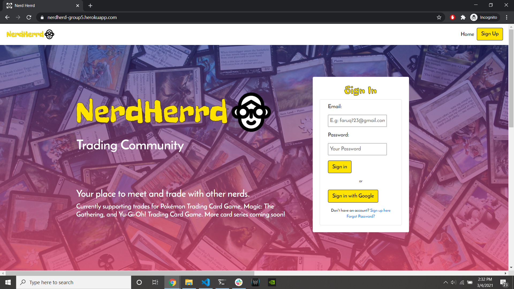

 # Nerd Herrd Trading Community

https://nerdherd-group5.herokuapp.com/
    
## Table of Contents
- [Description](#Description)
- [Installation](#Installation)
- [Usage](#Usage)
- [Contributing](#Contributing)
- [Questions](#Questions)

## Description
> Welcome to Nerd Herrd! Our website creates a niche market for trading card fans to connect with and trade cards with others. Our selection of card tyoes currently features Pokemon, Yu-Gi-Oh!, and Magic: The Gathering, three of the most popular trading card games in the world. Users can add cards to their profile, find others who are in possession of a card they wish to trade for, and negogiate terms using our built in chat room. This project was built using a full MERN stack (mongo, express, react, node), along with APIs for authentication, card data, and real time messaging.

## Installation
> To install this program for testing purposes, you can clone the repo to your local machine. Navigate to the directory it was cloned to and run an "npm install" from you terminal to install all necessary dependencies. From there run the command "npm start" and you're good to go!

## Usage
> To use our project, navigate to the site and create an account. Once you have an account, you'll be redirected to the dashboard. This is where you'll find all your trades, and where you'll search for other users/cards you would like to trade for. To add cards to your account, navigate to the search page, select the series of card you wish to search for, and enter the name. Once you've added a card, you can find it on your profile page. Finally, to message another user, you must navigate to their profile first. To do this, either search for their username, or a card they have in their profile from the dashboard. Once on their profile, you'll be able to create a new message thread with that user. Once the thread exists, you can navigate straight to the messages page and chat away!

## Contributions
> If you wish to contribute to our program, please use the links below to contact one of our team members directly.

## Questions
To reach the team with any additional questions:
>
> Find us on Github:
> - [Nick](https://github.com/nickkdb)
> - [Kyle](https://github.com/kshaq777) 
> - [Sam](https://github.com/scibettas1) 
> - [Kaitlin](https://github.com/kaitlinkenney) 
> - [Janae](https://github.com/janaec) 
> - [Andres](https://github.com/apemint)  

